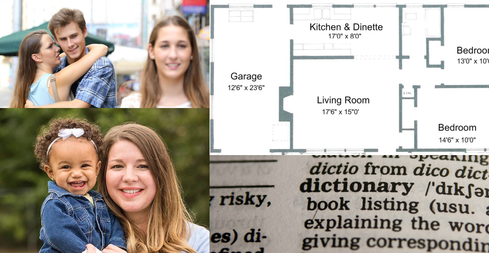

## Automatic redaction 

Isthmus / Mitchellpkt

Detects {faces, text, tattoos} in images and videos, then automatically redacts them.

Modes include:
-  Box: Draws non-filled rectangle around face (debugging mode, no privacy)
-  Blur: Applies a Gaussian Blur filter over the face, kernel size adjustable in settings
-  Block: Draws filled rectangle over face (most privacy)

## Input:

## Output:

